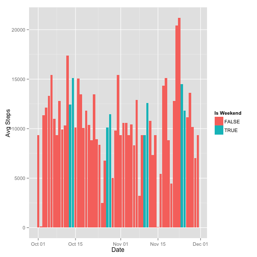

# Reproducible Research: Peer Assessment 1


## Loading and preprocessing the data

```r
setwd("~/Documents/Online Classes/Coursera/Reproducible Research/RepData_PeerAssessment1/")
stepdata=read.csv(unz("activity.zip","activity.csv"),header=TRUE,sep=',')
dailytotals = tapply(stepdata$steps,stepdata$date,FUN=sum,na.rm=T)
df=as.data.frame(dailytotals)
df = data.frame(as.Date.character(rownames(dailytotals)),dailytotals)
colnames(df)[1]="date"
row.names(df) = NULL
barplot(df$dailytotals,col=rainbow(10),xlab="Days",ylab="Steps (daily)")
```

 

## What is mean total number of steps taken per day?

```r
stepmean = mean(df$dailytotals)
stepmed = median(df$dailytotals)
cat("Mean: ",stepmean,"   Median: ",stepmed)
```

```
## Mean:  9354    Median:  10395
```

## Imputing missing values

```r
cat("Number of NA values: ",sum(is.na(stepdata$steps)))
```

```
## Number of NA values:  2304
```

```r
df[dailytotals==0,2] = stepmean
cat("Mean: ",mean(df$dailytotals),"   Median: ",median(df$dailytotals))
```

```
## Mean:  10581    Median:  10395
```

```r
cat("Yes, the Mean changes because the imputed value is greater than zero")
```

```
## Yes, the Mean changes because the imputed value is greater than zero
```

## What is the average daily activity pattern?

```r
dailyavg = tapply(stepdata$steps,stepdata$interval,FUN=mean,na.rm=T)
da = data.frame(matrix(unlist(dailyavg)))
da = cbind(rownames(dailyavg),da)
colnames(da) = c("interval","intavg")
da$interval = as.numeric(as.character(da$interval))
plot(da$interval,da$intavg,pch=NA,xlab='5-Min Interval',ylab="Avg Steps")
lines(da$interval,da$intavg,pch=NA,col="blue")
```

 

```r
cat("Maximum Number of Steps - 5-Min Interval is at 835 or 8:35AM")
```

```
## Maximum Number of Steps - 5-Min Interval is at 835 or 8:35AM
```

## Are there differences in activity patterns between weekdays and weekends?

```r
library(ggplot2)
df[, 3] = weekdays(df$date) == c("Saturday","Sunday")
```

```
## Warning: longer object length is not a multiple of shorter object length
```

```r
colnames(df)[3] = "weekend"
qplot(x=df$date,y=df$dailytotals,data=df,geom="histogram",fill=df$weekend) + geom_bar(stat="identity") + xlab("Date") + ylab("Avg Steps") + scale_fill_discrete("Is Weekend")
```

 
